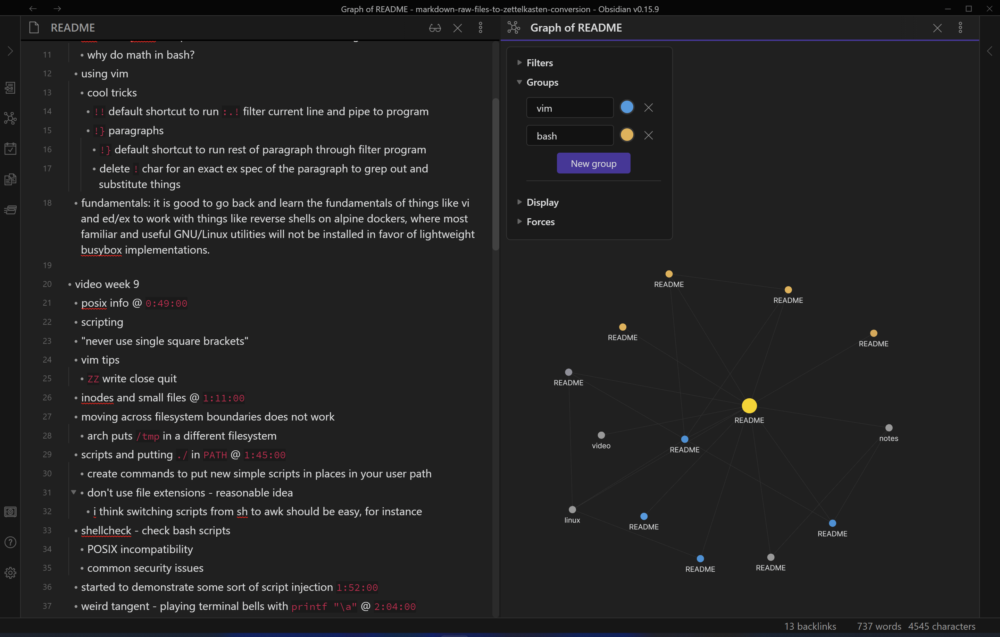

# markdown-raw-files-to-zettelkasten-conversion
Attempt at converting a library of raw markdown files in directories into a Zettelkasten

- [information about this project](/zet/20221006013612/README.md)
  - [findings](/zet/20221007043646/README.md)
- [hacking notes mega node](/zet/20221007220451/README.md)
  - [hacking to try lists](/zet/20221009102436/README.md)
    - [linux privesc](zet/20221003151210/README.md)
  - [OSCP prep](/zet/20221009005402/README.md)
- [the concept of todo lists](/zet/20221007044552/README.md)
- [work in progress](/zet/20221008042814/README.md)
- screenshot
