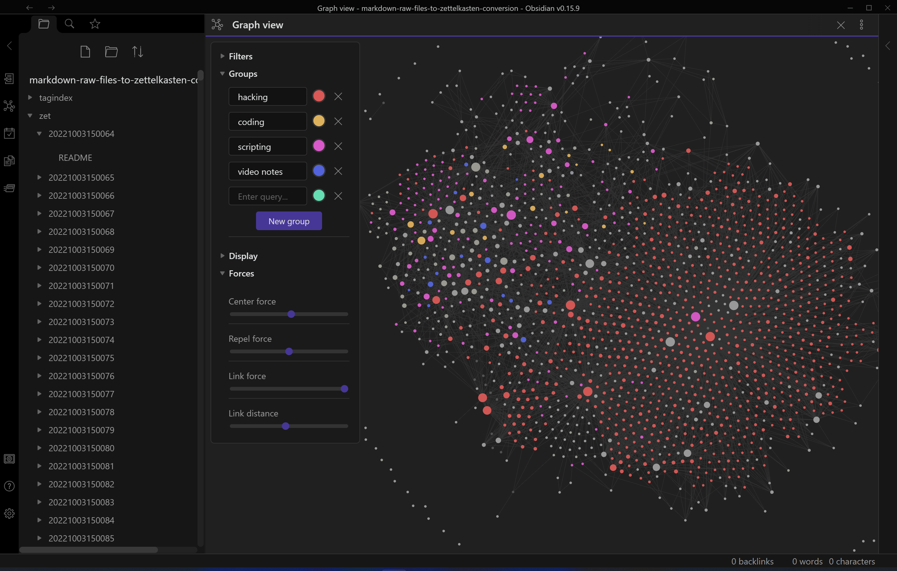

# main page for markdown-raw-files-to-zettelkasten-conversion
Attempt at converting a library of raw markdown files in directories into a Zettelkasten

- what a zettelkasten is and why i'm converting my notes
  - [information about this project](/zet/20221006013612/README.md)
  - [findings](/zet/20221007043646/README.md)
  - [20221010184202](/zet/20221010184202/README.md) screenshots of github ui graph showing workflow acceleration
  - [20221006032546](/zet/20221006032546/README.md) my implementation of zet cmd
    - [20221008063052](/zet/20221008063052/README.md) autorunning scripts in cards
  - [20221007182026](/zet/20221007182026/README.md) scripts related to zettelkasten conversion
- screenshots
  - [20221009172522](/zet/20221009172522/README.md) obsidian
  - what it looks like in the graph view in obsidian
  
  - video notes and a local graph
  
- [hacking notes hub](/zet/20221007220451/README.md)
  - [20221011092421](/zet/20221011092421/README.md) hacking video notes
  - [hacking to try lists](/zet/20221009102436/README.md)
    - [linux privesc](zet/20221003151210/README.md)
    - [20221003151207](/zet/20221003151207/README.md) windows privilege escalation
  - [OSCP prep](/zet/20221009005402/README.md)
- [concept hub for all todo lists](/zet/20221007044552/README.md)
  - [work in progress](/zet/20221008042814/README.md)
  - [20221009100510](/zet/20221009100510/README.md) concept of finished / being done
- [20221008183326](/zet/20221008183326/README.md) findings about video notes
- [stuff that should be on this page](/zet/20221009192000/README.md)
- [recently created notes](/zet/20221012171100/README.md)

- where to i put these?
- [20221006213953](/zet/20221006213953/README.md) video notes
- [20221008061845](/zet/20221008061845/README.md) workflow
- [20221007043259](/zet/20221007043259/README.md) zettelkasten generic ideas
- [20221011155715](/zet/20221011155715/README.md) video of how to make a node in my implementation
- [20221008061334](/zet/20221008061334/README.md) concepts
- [20221009104752](/zet/20221009104752/README.md) stuff to research
- [20221007185940](/zet/20221007185940/README.md) unsorted nodes
- [20221003151172](/zet/20221003151172/README.md) active directory domain
- [20221011181347](/zet/20221011181347/README.md) hacking notes template 1
