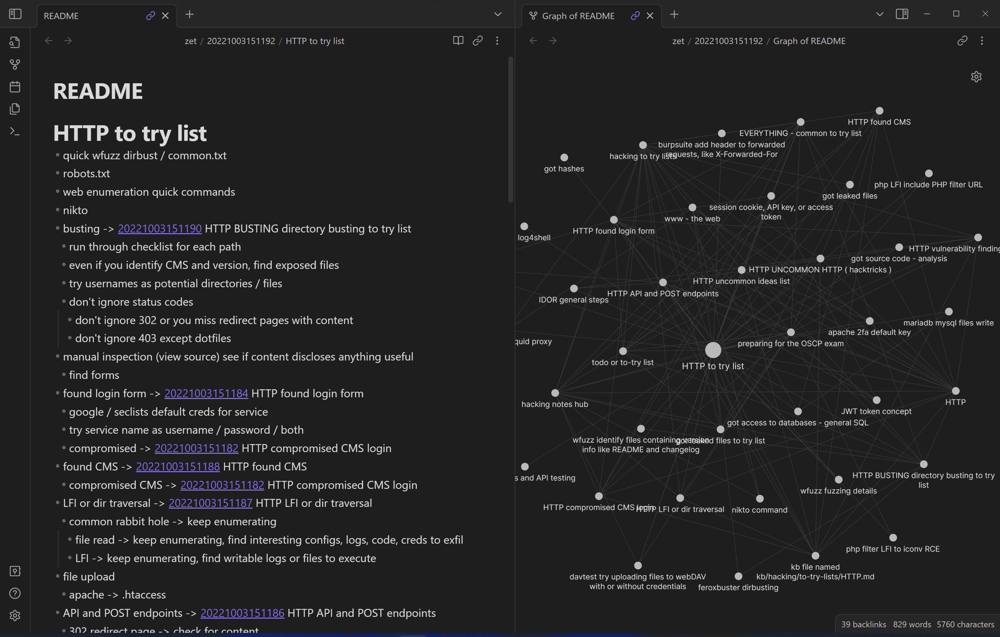

# Hacking notes Zettelkasten - Nicholas Long

Attempt at converting a library of raw markdown files in directories into a Zettelkasten

- [my implementation of zet cmd](/zet/20221006032546/README.md)
  
  - [video of how to make a node in my implementation](/zet/20221011155715/README.md)
  - [autorunning scripts in cards](/zet/20221008063052/README.md)
  - [zettelkasten generic ideas](/zet/20221007043259/README.md)
- scripted card behavior / reports
  - [template example card to run command output in snippet #meta #command](/zet/20221021081636/README.md)
  - [how many cards you got now #idea #report](/zet/20221028033132/README.md)
- what a zettelkasten is and why i'm converting my notes
  - [start walking down memory lane](/zet/20221016233254/README.md)
  - [information about this project](/zet/20221006013612/README.md)
  - [findings](/zet/20221007043646/README.md)
  - [screenshots of github ui graph showing workflow acceleration](/zet/20221010184202/README.md)
  - [scripts related to zettelkasten conversion](/zet/20221007182026/README.md)
## screenshots
- graph titles in [obsidian](/zet/20221009172522/README.md) with plugins
  - 
- what it looks like in the graph view in [obsidian](/zet/20221009172522/README.md)
  
- video notes and a local graph
  

# nav

## search by [tags](/tagindex/)

## hub for [hacking notes](/zet/20221007220451/README.md)

- [hacking video notes](/zet/20221011092421/README.md)
- [hacking notes template 1](/zet/20221011181347/README.md)
- [hacking to try lists](/zet/20221009102436/README.md)
  - [active directory domain](/zet/20221003151172/README.md)
  - [windows privilege escalation](/zet/20221003151207/README.md)
  - [linux privesc](zet/20221003151210/README.md)
- [OSCP prep](/zet/20221009005402/README.md)

## other [hubs](/tagindex/hub.md)

- [hub of todo lists](/zet/20221007044552/README.md)
  - [work in progress](/zet/20221008042814/README.md)
  - [concept of finished / being done](/zet/20221009100510/README.md)
- [video notes](/zet/20221006213953/README.md)
- [concepts](/zet/20221008061334/README.md)
  - [workflow](/zet/20221008061845/README.md)
- [stuff to research](/zet/20221009104752/README.md)
- [findings about video notes](/zet/20221008183326/README.md)
- [stuff that should be on this page](/zet/20221009192000/README.md)
- [recently created notes](/zet/20221012171100/README.md)
- [unsorted nodes](/zet/20221007185940/README.md)

## recent developments

- [recently created nodes hub](/zet/20221012171100/README.md)
- [WIP work in progress](/zet/20221008042814/README.md)
