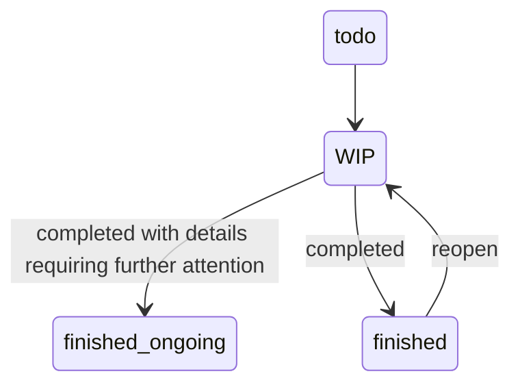

# project issue workflow

- concept of `project issue workflow`

` zet/20221021182334/README.md `

# Related

- [20221012171100](/zet/20221012171100/README.md) recently created nodes hub
- [20221008061845](/zet/20221008061845/README.md) workflow
- [20221007043646](/zet/20221007043646/README.md) findings about implementing zettelkasten

Tags:

    #diagram
