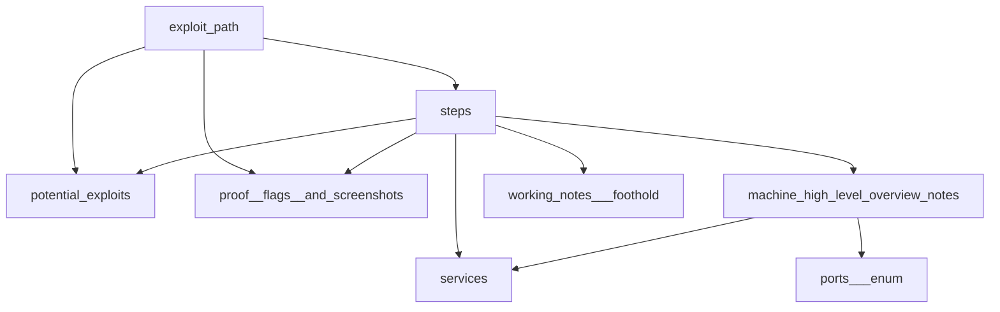

# generate mermaid graph from set of zet cards

- concept of `generate mermaid graph from set of zet cards`
- can use script `zet/20221014025416/tagboundary` to get tag boundaries of cards
  - example: print all connected nodes marked by notes tag
  `highlevel=20221011182140 # high level machine overview from notes template`
  `./graphquery --human <(zet/20221014025416/tagboundary $highlevel notes)`
- how to draw undirected graphs?

` zet/20221030041924/README.md `

# Related

- [20221017091309](/zet/20221017091309/README.md) mermaid tags for markdown diagrams
- [20221006032546](/zet/20221006032546/README.md) my implementation of zet cmd
- [20221021081636](/zet/20221021081636/README.md) template example card to run command output in snippet
- [20221008042814](/zet/20221008042814/README.md) WIP
- [20221014025416](/zet/20221014025416/README.md) clone a subsection of a graph by tag boundaries
- [20221012171100](/zet/20221012171100/README.md) recently created nodes hub
- [20221030050459](/zet/20221030050459/README.md) markdown on github

Tags:

    #idea #experiment
